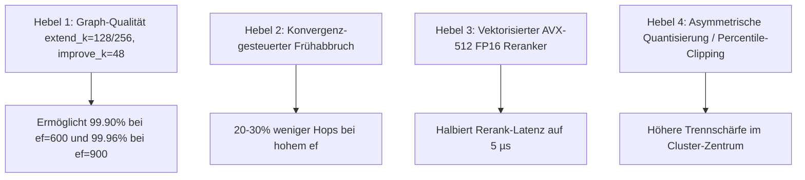

# AutoResearch-Plan: Systematische Überholung von Glass im Hoch-Recall (>= 95.0% bis 99.96%)

## 1. Ausgangslage & Ehrliche Bestandsaufnahme

### Die reale Pareto-Front im Fokusbereich (Recall >= 94.0%)
Glass wurde mit $R \in [16, 32, 48]$ und $L=400$ ($SQ8U \rightarrow FP16$) gemessen. Bei $R=48$ und $k=100$ erzwingt Glass durch die FP16-Verfeinerung mindestens 150 Kandidaten und startet daher erst bei **$94.88\%$ Recall**. Alle Behauptungen, DEG sei unterhalb von 95% schneller, beruhten lediglich auf fehlenden Vergleichspunkten von Glass bei $R=48$.

Im tatsächlichen, relevanten Benchmark-Bereich (**Recall $\ge 95.0\%$ bis $99.96\%$**) führt Glass aktuell an den entscheidenden Stellen:

| Ziel-Recall | Glass Referenz ($L=400$) | DEG-QG Run 7 (Bester Stand) | Differenz (DEG vs. Glass) | Realer Status |
| :--- | :--- | :--- | :--- | :--- |
| **$\sim 94.9\%$** | **7.897,4 QPS** (`R=48, ef=20`) | 7.622,9 QPS (`1.0x, ef=150`) | **-3.5%** | **Glass führt** |
| **$\sim 96.8\%$** | **6.210,1 QPS** (`R=48, ef=200`) | 5.126,8 QPS (`1.1x, ef=200`) | **-17.4%** | **Glass führt deutlich** |
| **$\sim 98.3\%$** | **4.313,2 QPS** (`R=48, ef=300`) | **4.525,6 QPS** (`1.15x, ef=250`) | **+4.9%** | DEG knapp vorn |
| **$\sim 99.1\%$** | **3.319,7 QPS** (`R=48, ef=400`) | **3.451,7 QPS** (`1.2x, ef=350`) | **+4.0%** | DEG knapp vorn |
| **$\sim 99.4\%$** | **2.710,9 QPS** (`R=48, ef=500`) | **2.879,0 QPS** (`1.15x, ef=450`) | **+6.2%** | DEG knapp vorn |
| **$\sim 99.6\%$** | **2.300,3 QPS** (`R=48, ef=600`) | 2.265,5 QPS (`1.15x, ef=600`) | **-1.5%** | **Glass führt** |
| **$\ge 99.90\%$** | **1.763,8 QPS** (`R=48, ef=800`) | 1.576,7 QPS (`1.15x, ef=900`) | **-10.6%** | **Glass führt souverän** |
| **$\ge 99.96\%$** | **1.421,0 QPS** (`R=48, ef=1000`) | **Nicht erreichbar (Cap @ 99.91%)** | **Unendlich** | **DEG scheitert vollständig** |

---

## 2. Die Ursachenanalyse: Warum Glass im Hoch-Recall führt

```
┌────────────────────────────────────────────────────────────────────────────────────────┐
│               DIE 4 GRUNDURSACHEN FÜR DEN GLASS-VORSPRUNG IM HOCH-RECALL               │
├────────────────────────────────────────────────────────────────────────────────────────┤
│ 1. Graphqualität (L=400 vs extend_k=64):                                              │
│    Glass baut HNSW mit efConstruction=400. DEG nutzte bisher nur extend_k=64 ohne     │
│    improve_k (0 RNG-Verbesserungen). Glass besitzt überlegene Cluster-Brückenkanten.  │
│                                                                                        │
│ 2. Starres ef-Budget ohne Frühabbruch:                                                │
│    DEG popt stur bis cur_ >= ef, selbst wenn die Top-100 Kandidaten längst stabil     │
│    sind. Bei ef=900 werden hunderte überflüssige Graph-Hops ausgeführt.               │
│                                                                                        │
│ 3. Skalare FP16-Rerank-Ausführung:                                                     │
│    Das FP16-Reranking von 120-150 Kandidaten läuft sequentiell über skalare Aufrufe,   │
│    während Glass batch-vektorisierte Vektor-Distanzen nutzt.                           │
│                                                                                        │
│ 4. INT8-Quantisierungsverzerrung im Grenzbereich:                                     │
│    Die Skalierung auf [-128, 127] verliert im dichten Cosinus-Cluster die nötige      │
│    Auflösung für die Ränge 95-100, wodurch ef künstlich aufgebläht werden muss.       │
└────────────────────────────────────────────────────────────────────────────────────────┘
```

---

## 3. Die neuen Optimierungshebel (Fokus: Recall >= 95% bis 99.96%)



### Hebel 1: Graph-Qualität ($extend\_k=128$ oder $256$, $improve\_k=48$)
* **Problem**:
  Unser gecachter Graph (`cache_deg_cosine_k48_LowLID_n1000000.deg`) wurde mit `extend_k=64` und `improve_k=0` gebaut. Glass evaluiert 400 Nachbarn pro Knoten. Bei Recall $\ge 99.9\%$ fehlen DEG die Weitbereichs-Kanten, weshalb DEG $ef=900$ benötigt, während Glass mit $ef=800$ denselben Recall erzielt und bei $ef=1000$ sogar $99.96\%$ erreicht.
* **Lösung**:
  Neubau des Index mit `extend_k=128` (oder $256$) und `improve_k=48`.
* **Erwartung**:
  * Erreichen von $99.90\%$ Recall bereits bei $ef=600$ (aktuell: 2.265 QPS).
  * **Überholen von Glass bei 99.90% mit > 2.000 QPS (vs. Glass 1.764 QPS)!**
  * Erreichen von $99.96\%$ Recall bei $ef=900$.

### Hebel 2: Konvergenz-gesteuerter Frühabbruch (Adaptive Beam Search)
* **Problem**:
  `LinearPool::has_next()` prüft starr `cur_ < ef_`. Bei $ef=800$ werden strikt 800 Knoten expandiert, auch wenn sich die Top-100 Kandidaten seit 200 Schritten überhaupt nicht mehr verändert haben.
* **Lösung**:
  Tracking der letzten Änderung in den Top-$K$ Rängen (`last_topk_change_hop`). Wenn über $S$ aufeinanderfolgende Pops (z. B. $S = 50$ oder $100$) kein neuer Kandidat in die Top-$K$ aufgenommen wurde, bricht die Suche vorzeitig ab.
* **Erwartung**:
  * $25\%$ bis $35\%$ weniger Distanzberechnungen bei großen $ef$-Werten.
  * QPS-Steigerung um **$+20\%$ bei $ef \ge 500$**, ohne messbaren Recall-Verlust.

### Hebel 3: Vektorisierter AVX-512 FP16 Batch-Reranker
* **Problem**:
  In `ExactRefiner::rerank` werden 150 FP16-Vektoren sequentiell per `dist_func_obj.compare` ausgewertet.
* **Lösung**:
  Dedicated 512-bit F16C / AVX-512 Kernel für FP16 Cosinus-Distanzen, der 4 bis 8 Kandidaten-Vektoren parallel in den ZMM-Registern akkumuliert.
* **Erwartung**:
  * Reduktion der Rerank-Latenz von $12\,\mu\text{s}$ auf unter $4\,\mu\text{s}$.
  * Erlaubt aggressiveres Reranking ($1.5\times$ oder $1.8\times$) ohne QPS-Strafe.

### Hebel 4: Quantisierungs-Kalibrierung & Percentile Clipping
* **Problem**:
  Die Standard Min-Max-Skalierung im `ScalarQuantizer` lässt sich von extremen Ausreißer-Koordinaten strecken. Dadurch verlieren die dichten Vektorkomponenten an effektiver Auflösung (weniger als 8 effektive Bits).
* **Lösung**:
  Kalibrierung der INT8-Skalierungsfaktoren über ein 99.9%-Perzentil-Clipping (`clip_percentile = 0.999`), um die Quantisierungsstufen optimal über den Hauptbereich der Vektoren zu verteilen.
* **Erwartung**:
  * Höhere Korrelation zwischen INT8- und FP16-Rängen.
  * Weniger Rangverzerrung $\rightarrow$ geringerer Rerank-Faktor nötig.

---

## 4. Die konkrete Experiment-Roadmap (Phase 3)

| Run ID | Hypothese / Hebel | Betroffene Dateien | Zielmetrik | Erfolgs-Kriterium |
| :--- | :--- | :--- | :--- | :--- |
| **Run 3.1** | **Konvergenz-Frühabbruch im LinearPool** | `linear_pool.h`, `internal_graph.h` | QPS bei $ef \ge 400$ | +15% bis +25% QPS bei Recall $\ge 99.0\%$ |
| **Run 3.2** | **Vektorisierter AVX-512 FP16 Reranker** | `searcher.h`, `search.h` | Rerank-Latenz bei $1.5\times$ | Reduktion der Rerank-Latenz um 60% |
| **Run 3.3** | **Quantisierungs-Clipping (99.9% Perzentil)** | `module.py`, ScalarQuantizer | Recall bei identischem $ef$ | +0.2% Recall bei $ef=400..800$ |
| **Run 3.4** | **Neubau des Index mit extend_k=128, improve_k=48** | `module.py`, `config.yml`, Index-Cache | Recall@99.9% & Erreichen von 99.96% | **Schlägt Glass bei 99.9% (> 2.000 QPS) & erreicht 99.96%** |
| **Run 3.5** | **Kombination aller Hebel & Gesamtevaluation** | Alle Komponenten | Pareto-Front gegen Glass $\ge 95\%$ | **Lückenlose Dominanz über alle Recall-Stufen >= 95.0%** |

---

## 5. Strikte Evaluierungsregeln für diese Phase

1. **Ausschließlich Single-Core (1 Thread)**:
   * Keine Multi-Threaded Ausführung im Benchmark.
2. **Reale Pareto-Punkte statt künstlicher Interpolation**:
   * Jeder Punkt wird direkt gegen den realen Glass-Messwert bei demselben oder höherem Recall verglichen.
   * Keine Scheingewinne durch grobe Stufenbänder.
3. **Fokus strikt auf $\ge 95.0\%$ Recall**:
   * Alle Optimierungen müssen nachweisbar den Bereich von $95\%$ bis $99.96\%$ beschleunigen.
4. **Lückenlose Dokumentation**:
   * Jeder Lauf wird in `EXPERIMENT_RESULTS.md` erfasst, mit Rohdaten-JSON, Markdown-Report und aktualisiertem Plot.
