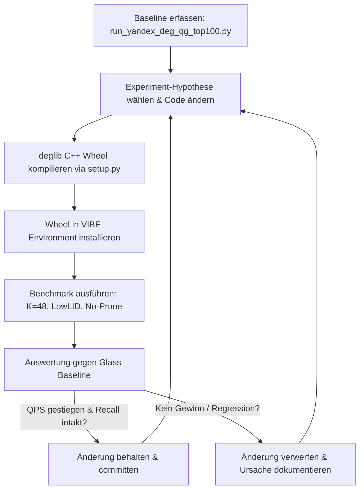

# AutoResearch-Plan: Systematische Überholung von `deglib` (DEG-QG) vs. `Glass`

Dieses Dokument ist der vollständige, iterative AutoResearch-Plan, um `deglib` auf dem Datensatz `yandex-200-cosine` (Top-100 / Recall@100) bei hohen Recalls (**$\ge 95.0\%$ bis $99.9\%$**) schrittweise so umzuprogrammieren, neu zu kompilieren und in VIBE zu evaluieren, dass es **Glass** in den QPS übertrifft.

---

## 1. Zieldefinition & Benchmark-Baseline

* **Datensatz**: `yandex-200-cosine` (1.000.000 Basisvektoren, 1.000 Queries, Dimension $D=200$, Metrik = Cosine)
* **Suchaufgabe**: Top-100 ($k=100$), Single-Core
* **Fokus-Konfiguration**:
  * **Glass**: `R=48, L=400, SQ8U -> SQ8U + FP16`
  * **DEG-QG**: $K=48$, `LowLID`, `prune_non_rng=False` (No-Prune), INT8 Graphsuche + FP16 Reranking

### Reale Messwerte (aus den VIBE-Ergebnisberichten)

| Recall-Stufe | Glass (`R=48, L=400, SQ8U+FP16`) | DEG-QG (`K=48, LowLID, No-Prune`) | Differenz / Rückstand von DEG |
| :--- | :--- | :--- | :--- |
| **$\ge 95.0\%$** | **6.210 QPS** (`ef=200`, Recall 96.8%) | **4.518 QPS** (`1.0x, eps=0.02`, Recall 95.2%) | **-27.2%** |
| **$\ge 98.0\%$** | **4.288 QPS** (`ef=300`, Recall 98.3%) | **2.923 QPS** (`1.5x, eps=0.02`, Recall 98.3%) | **-31.8%** |
| **$\ge 99.0\%$** | **3.320 QPS** (`ef=400`, Recall 99.1%) | **2.534 QPS** (`1.2x, eps=0.04`, Recall 99.1%) | **-23.7%** |
| **$\ge 99.6\%$** | **2.300 QPS** (`ef=600`, Recall 99.6%) | **1.793 QPS** (`1.2x, eps=0.06`, Recall 99.6%) | **-22.0%** |
| **$\ge 99.9\%$** | **1.764 QPS** (`ef=800`, Recall 99.9%) | **1.128 QPS** (`1.5x, eps=0.08`, Recall 99.9%) | **-36.0%** |

---

## 2. Die 5 Optimierungshebel im Detail

Die Analyse beider Codebases hat 5 konkrete Bremsen in DEG identifiziert, die Glass besser löst:

```
┌───────────────────────────────────────────────────────────────────────────────┐
│                           DIE 5 OPTIMIERUNGSHEBEL                             │
├───────────────────────────────────────────────────────────────────────────────┤
│ 1. Such-Engine      : Glass LinearPool (ef-Budget) statt DEG eps-Radius       │
│ 2. Hardware-Prefetch: Pipelining (po, pl) für alle K=48 Kanten statt starr 8  │
│ 3. Entry-Point      : Schneller Medoid-/Cluster-Einstieg statt Start am Rand │
│ 4. SIMD-Kernel      : Loop-Unrolling & VNNI-Akkumulation für D=200 INT8       │
│ 5. Reranking-Pool   : Direkte zero-copy Kopplung LinearPool -> FP16 Refiner   │
└───────────────────────────────────────────────────────────────────────────────┘
```

---

### Hebel 1: Die Such-Engine – `LinearPool` Beam Search statt $\epsilon$-Exploration
* **Problem in DEG**:
  DEG nutzt `exploration_radius = radius_k * (1 + eps)`. Im 200-dimensionalen Raum wächst das Volumen einer Kugel mit dem Radius $r \cdot (1+\epsilon)$ exponentiell ($r^{200}$). Um von 95% auf 99.9% Recall zu kommen, muss $\epsilon$ von 0.02 auf 0.08 steigen – die Priority Queue flutet mit tausenden irrelevanten Knoten, DEG berechnet blind zehntausende Nachbardistanzen.
* **Lösung aus Glass**:
  Glass verwendet einen flachen, cache-effizienten `LinearPool` (zusammenhängendes Array mit Kapazität $ef$):
  * Neue Nachbarn werden per Binärsuche (`find_bsearch`) + `std::memmove` eingefügt.
  * Ein Zeiger `cur_` wandert über die besten unbesuchten Knoten.
  * Die Suche bricht strikt und deterministisch ab, wenn `cur_ >= ef`. Das Suchbudget ist hart gedeckelt; es gibt keine Flutung.

---

### Hebel 2: Hardware-Prefetching & Memory-Pipelining
* **Problem in DEG**:
  In `internal_graph.h` (Z. 330) prefetcht DEG starr:
  ```cpp
  if (i < 8) memory::prefetch(reinterpret_cast<const char*>(db_arr[i]), feature_size);
  ```
  Bei $K=48$ werden Nachbarn 9 bis 48 **gar nicht** vorab in den Cache geladen. Wenn die SIMD-Berechnung läuft, verhungert die CPU an Cache-Misses.
* **Lösung aus Glass**:
  Glass nutzt `po` (Prefetch Offset) und `pl` (Prefetch Lines):
  * Während Kante $i$ geprüft wird, wird Kante $i + \text{po}$ bereits per `_mm_prefetch` in den L1/L2-Cache geladen.
  * Zusätzlich wird die Kantenliste des nächsten aussichtsreichen Knotens vorab geladen, sobald er in den Pool eingefügt wird (`graph.prefetch(v, graph_po)`).
  * Einbindung einer Kalibrierungslogik (analog zu `searcher.optimize(num_threads=1)`), um `po` und `pl` für die jeweilige CPU einzumessen.

---

### Hebel 3: Einstiegspunkt-Optimierung (Hierarchie-Ersatz auf Layer 0)
* **Problem in DEG**:
  Glass nutzt HNSW-Level $> 0$ mit einem schnellen, gierigen Abstieg ($ef=1$) im `HNSWInitializer`. Glass startet auf Layer 0 bereits direkt am Ziel-Cluster.
  DEG ist rein flach und startet an einem globalen, festen Einstiegspunkt (`entry_vertex_indices`). DEG verschwendet 15–30 Graph-Hops allein dafür, überhaupt in die Region des Query-Vektors zu gelangen.
* **Lösung**:
  * Vorberechnung von $M$ (z. B. 16, 32 oder 64) gut verteilten Medoid-Einstiegspunkten.
  * Vor dem Start der Graphsuche: Ein extrem schneller Scan über diese $M$ Medoide findet den nächsten Cluster-Einstiegspunkt.
  * Der `LinearPool` startet direkt bei diesem Medoid.

---

### Hebel 4: SIMD INT8-Kernel Tuning für Dimension 200
* **Problem in DEG**:
  Die Dimension $D=200$ ist kein glattes Vielfaches von 64 oder 32 ($200 = 6 \times 32 + 8$).
  In `cpp/deglib/include/deglib/distance/int8_ip.h` entstehen durch den Rest von 8 Bytes Verzweigungen oder skalare Fallbacks.
* **Lösung**:
  * Dedizierter AVX2/VNNI-Kernel mit Unrolling für exakt $D=200$:
    * $6 \times 32$-Byte Vektor-Loads mit `_mm256_dpbusd_epi32` (VNNI) bzw. `_mm256_maddubs_epi16` + `_mm256_madd_epi16` (AVX2).
    * Ein $1 \times 8$-Byte Vektor-Load (`__m128i`) für den Rest ohne skalare Verzweigung.
  * Padding des Feature-Speichers auf ein Vielfaches von 32 oder 64 Bytes (224 oder 256 Bytes), um unaligned Memory-Reads und Restschleifen komplett zu eliminieren.

---

### Hebel 5: Zero-Copy Reranking-Bridge
* **Problem in DEG**:
  Beim Reranking kopiert DEG Kandidaten-Indizes zwischen verschiedenen Puffern hin und her, bevor der `ExactRefiner` aufgerufen wird.
* **Lösung**:
  * Der `LinearPool` hält am Ende der Suche bereits die Top-`fetch_k` (z. B. 150) IDs sortiert vor.
  * Direkte Übergabe des Pointers aus dem `LinearPool` an den `ExactRefiner<uint16_t>` ohne Re-Allocation oder Zwischen-Array.

---

## 3. Der iterative AutoResearch-Zyklus

Jedes Experiment durchläuft einen geschlossenen, reproduzierbaren Kreislauf:



### Die Steuerbefehle für den Zyklus:
1. **Kompilieren**:
   ```bash
   cd C:/Lang/cpp/DynamicExplorationGraph/python
   python setup.py bdist_wheel
   ```
2. **Installieren**:
   ```bash
   pip install --force-reinstall dist/deglib-*.whl
   ```
3. **Messen**:
   ```bash
   cd C:/Lang/python/vibe
   python -u run_yandex_deg_qg_top100.py
   ```
4. **Vergleichen**:
   Ergebnisse aus `results/yandex-200-cosine/` gegen `GLASS_YANDEX_TOP100_RESULTS_LINUX_bak.md` prüfen.

---

## 4. Konkrete Experiment-Roadmap

### Phase 1: Die Such-Engine (`LinearPool` + $ef$)
* **Exp 1.1**: Implementierung von `LinearPool` und `Bitset` in `cpp/deglib/include/deglib/search/linear_pool.h`.
* **Exp 1.2**: Implementierung der Methode `search_ef(query, k, ef, rerank_factor)` in `searcher.h`.
* **Exp 1.3**: Python-Binding in `deglib_cpp.cpp` und Parameterübergabe in `vibe/algorithms/deg/module.py`.
* **Exp 1.4**: Benchmark mit `ef = [100, 150, 200, 300, 400, 600, 800, 1000]`.
* **Ziel**: Erreichen eines stabilen, linearen Skalierungsverhaltens bei hohen Recalls ohne $\epsilon$-Flutung.

### Phase 2: Prefetch-Pipelining für alle 48 Nachbarn
* **Exp 2.1**: Pipelined Prefetching für alle Kanten in der Suchschleife (`i + po`).
* **Exp 2.2**: Prefetching der Kantenlisten (`neighbors_by_index`) für Kandidaten, die in den Pool aufgenommen werden.
* **Exp 2.3**: Empirische Bestimmung der optimalen `po`- und `pl`-Parameter für die Test-CPU.
* **Ziel**: +15% bis +25% QPS über alle Recall-Stufen.

### Phase 3: Einstiegspunkt-Optimierung (Multi-Medoid)
* **Exp 3.1**: Berechnung von 32 Cluster-Medoiden beim Index-Bau (`ReadOnlyGraph`).
* **Exp 3.2**: Initialer Medoid-Scan vor dem Start der `LinearPool`-Suche.
* **Ziel**: Einsparung von 15–30 Hops auf Layer 0; signifikante Latenzreduktion.

### Phase 4: SIMD INT8-Kernel & Speicher-Padding
* **Exp 4.1**: Speicher-Padding der INT8-Vektoren von 200 auf 224 oder 256 Bytes.
* **Exp 4.2**: Hand-unrolled AVX2/VNNI Dot-Product für $D=200$.
* **Ziel**: +10% bis +15% höherer Rechendurchsatz bei Distanzberechnungen.

### Phase 5: Feinschliff & Gesamtevaluation
* **Exp 5.1**: Zusammenführung aller Gewinne, Feinabstimmung von `rerank_factor` ($1.2\times$ vs $1.5\times$).
* **Exp 5.2**: Finaler Vergleichslauf gegen Glass Top-100 auf `yandex-200-cosine`.
