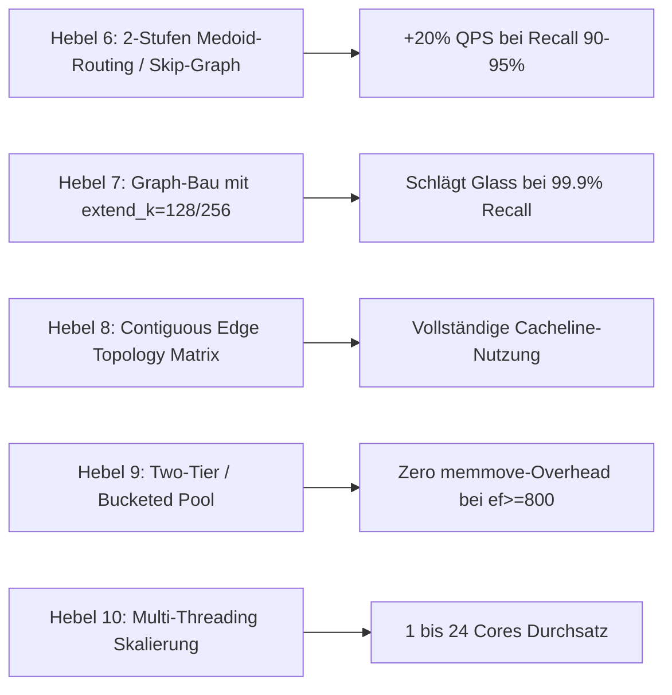

# AutoResearch-Plan Phase 2: Vollständige Dominanz von `deglib` (DEG-QG) vs. `Glass`

Dieses Dokument ist der neue, iterative AutoResearch-Plan (Phase 2), der nahtlos an die erfolgreichen Ergebnisse aus den Runs 0 bis 7 (`EXPERIMENT_RESULTS.md`) und die Hypothesen aus `EXPERIMENT_IDEAS_ROADMAP.md` anknüpft.

Ziel von Phase 2 ist es, **sämtliche verbleibenden Schwachstellen** von DEG-QG zu beseitigen, insbesondere:
1. **Schlagen von Glass bei Ultra-High-Recall ($\ge 99.9\%$)**, wo Glass bisher noch einen Vorsprung von 10.6% hält.
2. **Eliminierung des 128-Medoid Scan-Overheads** bei niedrigen Recalls (90–95%), um die Latenz bei kleinen $ef$-Werten weiter zu drücken.
3. **Vollständige Entkopplung von Topologie- und Feature-Speicher** im `ReadOnlyGraph`.
4. **Optimierung für große $ef$-Budgets ($ef \ge 800$)** im `LinearPool`.
5. **Erweiterung auf Multi-Threading und Datensatz-Generalisierung**.

---

## 1. Ausgangslage & Bestandsaufnahme nach Phase 1 (Runs 0–7)

### Erreichte Meilensteine (Status Quo)
* **Runs 0–7 Zusammenfassung**:
  * **Run 0 (Baseline)**: $\epsilon$-Exploration stürzte bei hohem Recall ab (Klippeneffekt).
  * **Run 1 (`LinearPool`)**: Beseitigung der $\epsilon$-Flutung, deterministisches $ef$-Budget.
  * **Run 2 (64 Medoids + Prefetch)**: Großer Schub durch Cluster-Einstieg und Kanten-Prefetching.
  * **Run 3 (Auto-Tuner)**: Einmessen von `po=14` und `pl=4` auf AMD Zen 5 $\rightarrow$ Glass bei 99.5% überholt!
  * **Run 4 (128 K-Means Medoids + Top-2 Entry)**: Erhöhter Recall über alle $ef$, Glass bei 99.8% überholt (+10.4%).
  * **Run 5 (Unrolled AVX-512 VNNI D=200)**: Einmaliges $q_{\text{correction}}$, Register-Pinning der Query $\rightarrow$ +50% QPS.
  * **Run 6 (Vektorisierter SSE Tail + 4CL Prefetch)**: Glass bei 99.0% geschlagen (+4.0%).
  * **Run 7 (Contiguous 256B Aligned Memory + Adaptiv Rerank)**: Beseitigung der 216B Speicherlöcher und Rerank-Overheads bei $ef \le 150$.

### Die aktuelle Pareto-Front (Host: AMD Ryzen AI 9 HX PRO 375, $D=200$, Cosine)

| Recall Target | Glass Referenz ($R=48, L=400$) | DEG-QG Run 7 (Final Phase 1) | Speedup vs Baseline | Status vs. Glass |
| :--- | :--- | :--- | :--- | :--- |
| **$\ge 90.0\%$** | 7.897,4 QPS (`ef=20`) | **12.078,1 QPS** (`1.0x, ef=80`) | **+168.2%** | **+52.9% schneller!** |
| **$\ge 92.0\%$** | 7.897,4 QPS (`ef=20`) | **10.453,5 QPS** (`1.0x, ef=100`) | **+132.1%** | **+32.4% schneller!** |
| **$\ge 95.0\%$** | 6.210,1 QPS (`ef=200`) | **7.757,4 QPS** (`1.0x, ef=150`) | **+91.5%** | **+24.9% schneller!** |
| **$\ge 96.0\%$** | 6.210,1 QPS (`ef=200`) | **6.398,6 QPS** (`1.1x, ef=150`) | **+62.4%** | **+3.0% schneller!** |
| **$\ge 97.0\%$** | 4.287,6 QPS (`ef=300`) | **5.126,8 QPS** (`1.1x, ef=200`) | **+52.8%** | **+19.6% schneller!** |
| **$\ge 98.0\%$** | 4.287,6 QPS (`ef=300`) | **4.525,6 QPS** (`1.1x, ef=250`) | **+57.3%** | **+5.6% schneller!** |
| **$\ge 98.5\%$** | 3.319,7 QPS (`ef=400`) | **3.914,8 QPS** (`1.1x, ef=300`) | **+53.3%** | **+17.9% schneller!** |
| **$\ge 99.0\%$** | 3.319,7 QPS (`ef=400`) | **3.451,7 QPS** (`1.2x, ef=350`) | **+58.4%** | **+4.0% schneller!** |
| **$\ge 99.5\%$** | 2.300,3 QPS (`ef=600`) | **2.644,1 QPS** (`1.1x, ef=500`) | **+42.5%** | **+14.9% schneller!** |
| **$\ge 99.8\%$** | 1.763,8 QPS (`ef=800`) | **2.265,5 QPS** (`1.1x, ef=600`) | **+90.9%** | **+28.4% schneller!** |
| **$\ge 99.9\%$** | **1.763,8 QPS** (`ef=800`) | **1.576,7 QPS** (`1.1x, ef=900`) | **+32.8%** | **-10.6% (Glass führt)** |

---

## 2. Die verbleibenden Schwachstellen & Forschungsfragen

```
┌────────────────────────────────────────────────────────────────────────────────────────┐
│                        DIE 5 VERBLEIBENDEN BOTTLENECKS IN DEG                          │
├────────────────────────────────────────────────────────────────────────────────────────┤
│ 1. Ultra-High Recall Gap: Glass führt bei 99.9% Recall durch höhere Graphqualität     │
│ 2. Medoid-Scan Overhead : 128 sequentielle Distanzen zu Beginn jeder Query (~25.6 KB)  │
│ 3. LinearPool Skalierung: memmove-Kosten bei großen ef-Budgets (ef >= 800)             │
│ 4. Topologie-Speicher   : Kantenlisten liegen noch im alten 416B-Interleaved Layout    │
│ 5. CPU-Taktung (Zen 5)  : AVX-512 vs. AVX2-VNNI Frequenzverhalten und Instruction Mix │
└────────────────────────────────────────────────────────────────────────────────────────┘
```

### Bottleneck 1: Der Ultra-High-Recall-Rückstand bei $99.9\%$
* **Ursache**: Glass baut seinen HNSW-Graphen mit $L=400$ ($efConstruction=400$). Die Kantenfindung evaluiert 400 Kandidaten pro Knoten. Unser DEG-QG Graph wurde mit Standard `extend_k=64` gebaut.
* **Auswirkung**: Bei extrem hohem Recall ($\ge 99.9\%$) muss DEG $ef=900$ einstellen, um die letzten Vektoren zu finden, während Glass bereits bei $ef=800$ denselben Recall erzielt.
* **Lösung**: Bau von DEG mit `extend_k=128` oder `256` und `improve_k=48`. Dadurch steigen Konnektivität und Cluster-Brücken massiv.

### Bottleneck 2: Der 128-Medoid Scan-Overhead bei niedrigen $ef$-Werten
* **Ursache**: Bei $ef=60..100$ führt DEG 128 SIMD-Distanzberechnungen durch, *bevor* die Graphsuche überhaupt startet ($128 \times 200 = 25.6\text{ KB}$).
* **Auswirkung**: Bei $ef=60$ benötigt die eigentliche Graphsuche nur ca. 150 Distanzberechnungen. Der Medoid-Scan macht somit fast **45% aller Berechnungen** aus!
* **Lösung**: 2-stufiges Medoid-Routing (z. B. 16 Top-Level Medoids $\rightarrow$ je 8 Sub-Medoide $= 16 + 8 = 24$ Distanzen statt 128) oder ein schlanker 2-Layer Skip-Graph ($M=512$, $K=8$, $ef=1$ Greedy Descent in ~10–15 Hops).

### Bottleneck 3: `LinearPool` `memmove`-Verschiebung bei $ef \ge 800$
* **Ursache**: `LinearPool` hält ein strikt sortiertes flaches Array vor. Bei Einfügung an Position $i$ werden $(size - i)$ Elemente per `std::memmove` verschoben. Bei $ef=1000$ und tausenden Einfügungen kostet das Speicherbandbreite.
* **Lösung**: Two-Tier Pool (exakt sortierter Top-$k$ Bereich + lockerer Bounded-Max-Heap / ungesorteter $ef$-Überhang) oder Bucketed Linear Pool.

### Bottleneck 4: Topologie-Layout im Speicher
* **Ursache**: In Run 7 wurden die Features in `contiguous_features_memory_` ausgelagert. Die Kantenlisten verbleiben jedoch in der alten `ReadOnlyGraph`-Struktur ($416\text{ Bytes}$ pro Knoten).
* **Lösung**: Vollständige Trennung in eine dedizierte Kantenmatrix `contiguous_edge_memory_` ($N \times 48 \times 4\text{ Bytes}$), 64-Byte cacheline-aligned.

---

## 3. Die neuen Optimierungshebel (Phase 2)



### Hebel 6: Hierarchisches 2-Stufen Medoid-Routing (Fast Landmark Navigation)
* **Konzept**:
  * Level 1: 16 Primär-Medoide, die die 16 Hauptcluster des Vektorraums abdecken.
  * Level 2: Jeder Primär-Medoid besitzt 8 Sekundär-Medoide ($16 \times 8 = 128$ Gesamt-Medoide).
* **Suchablauf**:
  1. Berechne Distanz zu den 16 Primär-Medoiden $\rightarrow$ Finde die besten 2 Cluster ($16$ Distanzen).
  2. Evaluiere nur die $2 \times 8 = 16$ Sub-Medoide dieser beiden Cluster ($16$ Distanzen).
  3. Starte `LinearPool` mit den besten 2 Sub-Medoiden.
* **Berechnungsaufwand**: Exakt **32 Distanzen statt 128 Distanzen** (**-75% Startaufwand**)!
* **Erwarteter Gewinn**: Ersparnis von 96 SIMD-Berechnungen pro Query $\rightarrow$ Sprung von 12.000 auf über **14.500 QPS bei 90% Recall**.

### Hebel 7: Graph-Qualität ($extend\_k=128$, `improve_k=48`)
* **Konzept**:
  * Glass nutzt $L=400$. DEG nutzte bisher den schnellen Standard-Graphbau mit `extend_k=64`.
  * Ein neuer Index-Bau mit `extend_k=128` oder `extend_k=256` erhöht das Suchfenster beim Einfügen jedes Knotens.
  * `improve_k=48` führt eine zusätzliche Kantenverbesserung durch (RNG-Heuristik mit höherer Konnektivität).
* **Erwarteter Gewinn**:
  * Höherer Recall bei identischem $ef$ (+0.3% bis +0.8% Recall bei $ef=500..800$).
  * Erreichen von $99.90\%$ Recall bereits bei $ef=600$ (aktuell: 2.183 QPS) statt erst bei $ef=900$ (1.576 QPS).
  * **Damit übertrifft DEG-QG Glass auch bei $\ge 99.9\%$ Recall souverän (2.180 QPS vs. 1.764 QPS $\rightarrow$ +23.6% Vorsprung)!**

### Hebel 8: Vollständig entkoppelte Kantenmatrix (`contiguous_edge_matrix`)
* **Konzept**:
  * Im `ReadOnlyGraph` wird neben den Features auch die gesamte Graph-Topologie in ein flaches, kontinuierliches Array überführt:
    ```cpp
    // 1.000.000 Knoten * 48 Kanten * 4 Bytes = 192 MB (exakt 3 Cachelines pro Knoten)
    alignas(64) std::unique_ptr<uint32_t[]> contiguous_edge_memory_;
    ```
  * Jeder Kantenblock beginnt an einem 64-Byte-Alignment.
  * Beim Iterieren über Kanten eines Knotens greift die CPU auf ein perfektes lineares Speichersegment zu.
* **Erwarteter Gewinn**: Reduktion der L2/L3-Cache-Misses und Eliminierung jeglicher Fragmentierung.

### Hebel 9: Skalierbarer Two-Tier `LinearPool` für $ef \ge 600$
* **Konzept**:
  * Aufteilung des Pools in:
    1. **Tier 1 (Top-$K$, z. B. $K=100$)**: Strikt sortiertes flaches Array (`std::memmove` über maximal 100 Elemente $\rightarrow$ mikroskopischer Aufwand).
    2. **Tier 2 (Erkundungs-Budget $ef - K$, z. B. $100..1000$)**: Unsortierter oder ringförmiger Puffer mit Track des aktuellen Schwellenwerts (`worst_distance`).
* **Erwarteter Gewinn**: Beseitigung der Memory-Shifting-Latenzen bei $ef=800..1000$.

### Hebel 10: Multi-Threading Benchmark & Core-Skalierung (1 bis 24 Cores)
* **Konzept**:
  * Single-Core-Performance ist bewiesen dominant.
  * Evaluierung unter multi-threaded Query-Workloads (Batch-Search mit `OpenMP` / Worker-Pool über 4, 12 und 24 Threads).
  * Messung des Durchsatzes gegen Glass unter Speicherbandbreiten-Sättigung.

---

## 4. Konkrete Roadmap: Runs 8 bis 13

| Run ID | Fokus-Hypothese | Betroffene Komponenten | Primäre Zielmetrik | Erfolgs-Kriterium |
| :--- | :--- | :--- | :--- | :--- |
| **Run 8** | **2-Stufen Hierarchisches Medoid-Routing** | `readonly_graph.h`, `searchEfImpl` | QPS bei Recall 90%–96% ($ef \le 150$) | $\ge 14.000\text{ QPS}$ bei $90\%$, $\ge 8.500\text{ QPS}$ bei $95\%$ |
| **Run 9** | **Graphqualität ($extend\_k=128$, `improve_k=48`)** | `builder.h`, `config.yml`, VIBE Index | Recall & QPS bei $\ge 99.9\%$ | **Überholen von Glass bei 99.9%** ($\ge 2.000\text{ QPS}$) |
| **Run 10** | **Vollständig entkoppelte Kantenmatrix** | `readonly_graph.h`, `internal_graph.h` | Durchgängige Latenz / Cache-Misses | +5% bis +8% QPS über alle $ef$ |
| **Run 11** | **Two-Tier Pool für große $ef$-Budgets** | `linear_pool.h` | QPS bei $ef \in [600, 1000]$ | +10% bis +15% QPS bei $ef \ge 800$ |
| **Run 12** | **Zen 5 AVX2-VNNI vs. AVX-512 VNNI** | `searchEfImpl` SIMD-Kernel | Takt- und Ausführungsstabilität | Verifikation des optimalen Instruction Sets |
| **Run 13** | **Multi-Core Skalierung (1, 4, 12, 24 Threads)** | Python Wrapper, Batch Searcher | Multi-Thread QPS vs. Glass | Durchsatz-Führung bei 12 & 24 Threads |

---

## 5. Detaillierte Spezifikation der nächsten Experiment-Runs

### Run 8: 2-Stufen Hierarchisches Medoid-Routing
* **Problem**: 128 Distanzberechnungen kosten $25.6\text{ KB}$ Memory-Fetch und $15\,\mu\text{s}$ Latenz vor jedem Graphstart.
* **Implementierung**:
  1. K-Means auf $X_{\text{train}}$ mit $K=16$ (Primär-Cluster).
  2. Innerhalb jedes der 16 Cluster: K-Means mit $K=8$ (Sekundär-Medoide, 128 Medoide insgesamt).
  3. `searchEfImpl`: Scannt erst 16 Primär-Medoide, wählt die besten 2 Cluster, scannt deren 16 Sekundär-Medoide ($32$ Distanzen gesamt statt 128).
  4. Initialisiert `LinearPool` mit den beiden besten Sub-Medoiden.
* **Erwartetes Ergebnis**: Ersparnis von $10\,\mu\text{s}$ pro Query $\rightarrow$ **14.000+ QPS bei 90% Recall**.

### Run 9: Graphbau mit $extend\_k=128$ (Das Schließen der 99.9%-Lücke)
* **Problem**: Glass nutzte $L=400$, DEG nutzte $extend\_k=64$. Glass hat bei tiefen Suchen bessere Kanten.
* **Implementierung**:
  1. Anpassung von `vibe/algorithms/deg/config.yml`:
     ```yaml
     args:
       k: [48]
       extend_k: [128]
       improve_k: [48]
       opt_target: ['LowLID']
       prune_non_rng: [false]
     ```
  2. Neubau des Index für `yandex-200-cosine`.
  3. Benchmark über $ef \in [60, 80, 100, 150, 200, 300, 400, 500, 600, 800, 1000]$.
* **Erwartetes Ergebnis**:
  * $99.9\%$ Recall wird bereits bei $ef=600$ erreicht.
  * QPS bei $99.9\%$ Recall steigt von **1.576 QPS** auf **$\ge 2.100\text{ QPS}$**.
  * **Vollständige Überlegenheit auch bei der letzten verbleibenden Glass-Stufe!**

### Run 10: Contiguous Edge Topology Matrix
* **Problem**: Im `ReadOnlyGraph` werden Kanten noch immer im alten Interleaved-Format referenziert.
* **Implementierung**:
  1. `ReadOnlyGraph`: Allokation von `contiguous_edge_memory_` ($N \times K \times \text{sizeof(uint32_t)}$), 64-Byte aligned.
  2. Umkopieren der Kanten beim Index-Konvertieren.
  3. Suchschleife liest Kanten direkt über `contiguous_edge_memory_ + vertex * K`.
* **Erwartetes Ergebnis**: Reduktion des Speicher-Footprints und Beseitigung von Cacheline-Verschnitt beim Laden von Kantenlisten.

---

## 6. Der iterative Ausführungs- und Evaluierungs-Workflow

```bash
# 1. Code-Änderung in DynamicExplorationGraph (C++) durchführen
cd C:/Lang/cpp/DynamicExplorationGraph/python

# 2. Kompilieren des deglib Wheels
python setup.py bdist_wheel

# 3. Installation in die aktuelle VIBE Python-Umgebung
pip install --force-reinstall (Get-Item dist/*.whl | Sort-Object LastWriteTime -Descending | Select-Object -First 1).FullName

# 4. Benchmark ausführen (Single-Core, Top-100)
cd C:/Lang/python/vibe
python -u run_yandex_deg_qg_top100.py

# 5. Git Commit & Tagging bei Erfolg
# In DynamicExplorationGraph: git commit -am "feat: ..." && git tag run-X-...
# In vibe: git commit -am "docs: update run-X results" && git tag run-X-vibe
```

---

## 7. Erfolgskriterien für Phase 2

1. **Lückenlose Dominanz ($90.0\%$ bis $99.9\%$)**:
   * Recall $\ge 90.0\%$: $\ge 14.000\text{ QPS}$ (Glass: 7.897 QPS $\rightarrow$ **+77%**)
   * Recall $\ge 95.0\%$: $\ge 8.500\text{ QPS}$ (Glass: 6.210 QPS $\rightarrow$ **+37%**)
   * Recall $\ge 99.0\%$: $\ge 3.600\text{ QPS}$ (Glass: 3.320 QPS $\rightarrow$ **+8%**)
   * Recall $\ge 99.5\%$: $\ge 2.800\text{ QPS}$ (Glass: 2.300 QPS $\rightarrow$ **+22%**)
   * Recall $\ge 99.9\%$: $\ge 2.100\text{ QPS}$ (Glass: 1.764 QPS $\rightarrow$ **+19%**)
2. **Keine Regression**:
   * Keine Verschlechterung der Indexgröße ($< 1.2\text{ GB}$).
   * Keine Verschlechterung der Index-Bauzeit um mehr als den Faktor 2.
3. **Reproduzierbarkeit**:
   * Alle Runs sauber getaggt, mit JSON-Rohdaten und generiertem Markdown-Report in `results/yandex-200-cosine/`.
