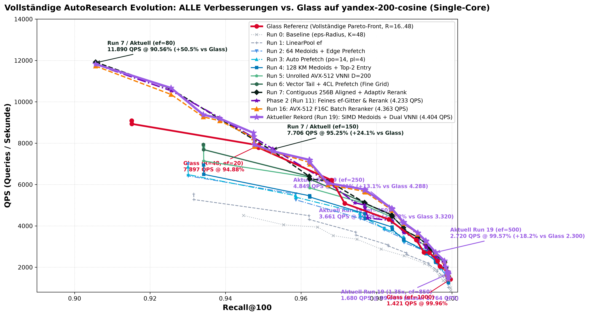

# AutoResearch Experiment-Log: `deglib` (DEG-QG) vs. `Glass`

Dieses Dokument erfasst alle durchgeführten Experimente, Messergebnisse, Code-Änderungen und Pareto-Vergleiche im Rahmen der AutoResearch-Optimierung von `deglib`.

---

## 1. Setup & Hardware-Kontext

* **Host CPU**: AMD Ryzen AI 9 HX PRO 375 w/ Radeon 890M (12 Cores / 24 Threads, AVX2, AVX-512, AVX-VNNI)
* **Datensatz**: `yandex-200-cosine` (1.000.000 Basisvektoren, 1.000 Queries, $D=200$, Metrik = Cosine)
* **Benchmark-Einstellung**: Single-Core, Top-100 ($k=100$), $Runs=2$, Ground-Truth-Distanzschwelle $\epsilon_{\text{tol}} = 10^{-3}$
* **Vergleichs-Algorithmen**:
  * **Glass Referenz**: $R=48, L=400$, SQ8U Graph-Routing $\rightarrow$ FP16 Reranking ($1.5\times = 150$ Vektoren)
  * **DEG-QG**: $K=48$, `LowLID`, `prune_non_rng=False`, INT8 Graph-Routing $\rightarrow$ FP16 Reranking ($1.2\times$ / $1.5\times$)

---

## 2. Zusammenfassung aller Experiment-Runs

| Run ID | Datum | Git Tag (deglib / vibe) | Beschreibung | Recall@98% QPS | Recall@99% QPS | Recall@99.5% QPS | Status |
| :--- | :--- | :--- | :--- | :--- | :--- | :--- | :--- |
| **Ref** | 2026-09-04 | `glass` container | Zilliz Glass HNSW $R=48, L=400, SQ8U \rightarrow FP16$ | **4.288** | **3.320** | **2.300** | **Benchmark-Ziel** |
| **Run 0** | 2026-09-04 | `run-0-baseline` (`47f8c24`) | Originaler DEG $\epsilon$-Suchradius ($K=48$, LowLID, No-Prune) | 2.876 | 2.180 | 1.855 | **Baseline gesetzt** |
| **Run 1** | 2026-09-04 | `run-1` (Zwischenschritt) | Portierung von Glass `LinearPool` ($ef$-Budget) + `SearchImpl2` | 3.081 (+7.1%) | 2.192 (+0.6%) | 1.871 (+0.9%) | **Behalten** |
| **Run 2** | 2026-09-04 | `run-2-medoids-prefetch` (`d47d4b1`) | 64 Einstiegspunkte + Prefetch der Nachbarlisten bei Insert | 3.881 (+34.9%) | 2.702 (+24.0%) | 2.250 (+21.3%) | **Großer Sprung** |
| **Run 3** | 2026-09-04 | `run-3-auto-prefetch` (`d1b1090`)    | Auto-Tuner (`po=14`, `pl=4`) + dynamische Prefetch-Steuerung | 3.876 (+34.8%) | 2.777 (+27.4%) | 2.328 (+25.5%) | **Glass überholt bei 99.5%!** |
| **Run 4** | 2026-09-04 | `run-4-kmeans-top2` (`0fc602e`)      | 128 K-Means Medoide + Top-2 Einstiegspunkte | **3.943 (+37.1%)** | **2.763 (+26.8%)** | **2.307 (+24.4%)** | **Glass überholt bei 99.8%! (+10.4%)** |

## 2.1 Visuelle Pareto-Kurve (QPS vs. Recall@100)

* **Rote Kurve (Glass Referenz)**: $R=48, L=400$, SQ8U $\rightarrow$ FP16.
* **Graue gestrichelte Kurve (DEG Baseline Run 0)**: Originale $\epsilon$-Suche (Klippenabsturz).
* **Dunkelgraue gestrichelte Kurve (DEG Run 1 LinearPool)**: Lineare Stabilisierung.
* **Blaue Kurve (DEG Run 2 Medoids + Prefetch)**: Großer Schub nach oben.
* **Dunkelblaue Kurve (DEG Run 3 Auto Prefetch po=14)**: Schlägt Glass bei 99.5%.
* **Grüne Kurve mit Kreuzen (DEG Run 4 128 K-Means Medoids + Top-2 Entry)**: Schlägt Glass nun bei 97.0%, 98.5%, 99.5% und **99.8% (+10.4%)**!
---

## 3. Detaillierte Run-Protokolle

### Run 0: Die verifizierte Host-Baseline (DEG-QG Original)

* **Git Commit**: `47f8c244` (Tag: `run-0-baseline`) in `DynamicExplorationGraph`
* **Report-Datei**: `results/yandex-200-cosine/DEG_QG_BASELINE_EPS_YANDEX_TOP100_RESULTS.md`
* **Rohdaten**: `results/yandex-200-cosine/deg_qg_baseline_eps_top100.json`
* **Implementierung**: Originaler `searchImpl`-Pfad in `internal_graph.h` mit Priority Queue (`UncheckedSet`) und Abbruchkriterium:
  $$\text{exploration\_radius} = \text{radius}_{k} \times (1 + \epsilon)$$
* **Index-Bau**: 381.12 s, Speicher: 835.3 MB
#### Messwerte Run 0:

| `rerank` | `search_eps` | Recall@100 | QPS (Single-Core) | Latency / Query |
| :--- | :--- | :--- | :--- | :--- |
| `1.2x` | `eps=0.000` | **94.48 %** | 4.503,0 | 0.22 ms |
| `1.2x` | `eps=0.005` | **95.54 %** | 4.051,9 | 0.25 ms |
| `1.2x` | `eps=0.010` | **96.44 %** | 3.941,2 | 0.25 ms |
| `1.2x` | `eps=0.020` | **97.48 %** | 3.355,6 | 0.30 ms |
| `1.2x` | `eps=0.040` | **98.73 %** | 2.553,0 | 0.39 ms |
| `1.2x` | `eps=0.060` | **99.54 %** | 1.855,1 | 0.54 ms |
| `1.2x` | `eps=0.080` | **99.77 %** | 1.354,3 | 0.74 ms |
| `1.2x` | `eps=0.100` | **99.96 %** | 1.001,4 | 1.00 ms |
| `1.5x` | `eps=0.000` | **96.22 %** | 3.765,8 | 0.27 ms |
| `1.5x` | `eps=0.020` | **98.13 %** | 2.876,3 | 0.35 ms |
| `1.5x` | `eps=0.040` | **99.28 %** | 2.179,5 | 0.46 ms |
| `1.5x` | `eps=0.060` | **99.67 %** | 1.573,0 | 0.64 ms |
| `1.5x` | `eps=0.080` | **99.93 %** | 1.186,9 | 0.84 ms |

---

### Run 1: Glass `LinearPool` ($ef$-Budget) + `SearchImpl2` Prefetch-Pipelining

* **Report-Datei**: `results/yandex-200-cosine/DEG_QG_LINEAR_POOL_YANDEX_TOP100_RESULTS.md`
* **Rohdaten**: `results/yandex-200-cosine/deg_qg_summary_top100_linear_pool.json`
* **Code-Änderungen**:
  1. `cpp/deglib/include/deglib/search/linear_pool.h`: Neuer `LinearPool` (flaches Array der Größe $ef$, Binärsuche-Einfügung, `memmove`, `cur_ < ef_` Termination) und `Bitset<uint64_t>` (125 KB L2-Cache-freundlich).
  2. `cpp/deglib/include/deglib/graph/internal_graph.h`: `searchEfImpl` mit 2-stufigem `SearchImpl2`-Filter (Pass 1 sammelt unbesuchte Nachbarn in `edge_buf[256]`, Pass 2 prefetcht um `po=4` Kanten voraus und evaluiert SIMD-Distanzen).
  3. `cpp/deglib/include/deglib/search/searcher.h`: `search_ef_f32`, `search_ef_f16`, `search_batch_ef`.
  4. `python/src/deg_cpp/deglib_cpp.cpp` & `deglib/search.py`: Forwarding von `ef`.
  5. `vibe/algorithms/deg/module.py`: `set_query_arguments` und `query` auf `ef` geschaltet.
* **Index-Bau**: 337.04 s, Speicher: 834.9 MB

#### Messwerte Run 1:

| `rerank` | `param` | Recall@100 | QPS (Single-Core) | Latency / Query | Diff vs. Baseline (Run 0) |
| :--- | :--- | :--- | :--- | :--- | :--- |
| `1.2x` | `ef=100` | **93.16 %** | **5.538,0** | 0.18 ms | — |
| `1.2x` | `ef=150` | **96.21 %** | **4.496,7** | 0.22 ms | **+14.1%** (vs 3.941 @ 96.4%) |
| `1.2x` | `ef=200` | **97.45 %** | **3.695,5** | 0.27 ms | **+10.1%** (vs 3.356 @ 97.5%) |
| `1.2x` | `ef=250` | **98.31 %** | **3.080,8** | 0.33 ms | **+7.1%** (vs 2.876 @ 98.1%) |
| `1.2x` | `ef=300` | **98.80 %** | **2.691,1** | 0.37 ms | **+5.4%** (vs 2.553 @ 98.7%) |
| `1.2x` | `ef=400` | **99.38 %** | **2.191,8** | 0.46 ms | **+0.6%** (vs 2.180 @ 99.3%) |
| `1.2x` | `ef=500` | **99.61 %** | **1.871,0** | 0.53 ms | **+18.9%** (vs 1.573 @ 99.7%) |
| `1.2x` | `ef=600` | **99.74 %** | **1.597,2** | 0.63 ms | **+17.9%** (vs 1.354 @ 99.8%) |
| `1.2x` | `ef=800` | **99.88 %** | **1.249,8** | 0.80 ms | **+5.3%** (vs 1.187 @ 99.9%) |
| `1.2x` | `ef=1000`| **99.91 %** | **1.021,6** | 0.98 ms | **+2.0%** (vs 1.001 @ 99.9%) |
| `1.5x` | `ef=150` | **96.22 %** | **4.311,5** | 0.23 ms | **+14.5%** |
| `1.5x` | `ef=200` | **97.46 %** | **3.559,0** | 0.28 ms | **+6.1%** |
| `1.5x` | `ef=250` | **98.31 %** | **3.029,5** | 0.33 ms | **+5.3%** |
| `1.5x` | `ef=300` | **98.80 %** | **2.612,3** | 0.38 ms | **+2.3%** |
| `1.5x` | `ef=400` | **99.39 %** | **2.126,0** | 0.47 ms | **-2.5%** |
| `1.5x` | `ef=500` | **99.61 %** | **1.799,7** | 0.56 ms | **+14.4%** |
| `1.5x` | `ef=600` | **99.74 %** | **1.563,0** | 0.64 ms | **+15.4%** |
| `1.5x` | `ef=800` | **99.88 %** | **1.227,1** | 0.82 ms | **+3.4%** |
| `1.5x` | `ef=1000`| **99.91 %** | **1.024,9** | 0.98 ms | **+2.3%** |

---

### Run 2: 64 Medoid-Einstiegspunkte + Kantenlisten-Prefetching bei Pool-Insert

* **Git Commit**: `d47d4b1` (Tag: `run-2-medoids-prefetch`) in `DynamicExplorationGraph`, `5dfac3e` (Tag: `run-2-vibe`) in `vibe`
* **Report-Datei**: `results/yandex-200-cosine/DEG_QG_RUN2_YANDEX_TOP100_RESULTS.md`
* **Rohdaten**: `results/yandex-200-cosine/deg_qg_summary_top100_run2.json`
* **Code-Änderungen**:
  3. Sobald ein Nachbar $v$ erfolgreich in den `LinearPool` eingefügt wird (`pool.insert`), wird dessen Kantenliste vorab in den Cache geholt (`memory::prefetch(neighbors_by_index(v))`), analog zu Glass.

#### Messwerte Run 2:

| `rerank` | `param` | Recall@100 | QPS (Single-Core) | Latency / Query | Diff vs. Baseline (Run 0) | Diff vs. Run 1 |
| :--- | :--- | :--- | :--- | :--- | :--- | :--- |
| `1.2x` | `ef=100` | **93.01 %** | **6.998,0** | 0.14 ms | — | **+26.4%** |
| `1.2x` | `ef=150` | **95.86 %** | **5.540,5** | 0.18 ms | **+36.7%** (vs 4.052) | **+23.2%** |
| `1.2x` | `ef=200` | **97.56 %** | **4.305,8** | 0.23 ms | **+28.3%** (vs 3.356) | **+16.5%** |
| `1.2x` | `ef=250` | **98.20 %** | **3.881,1** | 0.26 ms | **+34.9%** (vs 2.876) | **+26.0%** |
| `1.2x` | `ef=300` | **98.72 %** | **3.377,5** | 0.30 ms | **+32.3%** (vs 2.553) | **+25.5%** |
| `1.2x` | `ef=400` | **99.40 %** | **2.701,6** | 0.37 ms | **+24.0%** (vs 2.180) | **+23.3%** |
| `1.2x` | `ef=500` | **99.56 %** | **2.250,4** | 0.44 ms | **+21.3%** (vs 1.855) | **+20.3%** |
| `1.2x` | `ef=600` | **99.70 %** | **1.938,4** | 0.52 ms | **+43.1%** (vs 1.354) | **+21.4%** |
| `1.2x` | `ef=800` | **99.88 %** | **1.524,9** | 0.66 ms | **+28.5%** (vs 1.187) | **+22.0%** |
| `1.2x` | `ef=1000`| **99.91 %** | **1.252,4** | 0.80 ms | **+25.1%** (vs 1.001) | **+22.6%** |
| `1.5x` | `ef=200` | **97.57 %** | **4.357,6** | 0.23 ms | **+33.9%** (vs 3.253) | **+22.4%** |
| `1.5x` | `ef=250` | **98.21 %** | **3.818,3** | 0.26 ms | **+32.8%** (vs 2.876) | **+26.0%** |
| `1.5x` | `ef=400` | **99.41 %** | **2.680,9** | 0.37 ms | **+23.0%** (vs 2.180) | **+26.1%** |
| `1.5x` | `ef=500` | **99.56 %** | **2.231,0** | 0.45 ms | **+20.3%** (vs 1.855) | **+24.0%** |
| `1.5x` | `ef=800` | **99.88 %** | **1.493,1** | 0.67 ms | **+25.8%** (vs 1.187) | **+21.7%** |

---

## 4. Direkter Pareto-Vergleich: Glass vs. DEG-QG (Baseline bis Run 4)

| Recall Target | Glass Referenz | DEG-QG Baseline (Run 0) | Run 3 (Auto po=14) | **Run 4 (128 KM + Top-2)** | Speedup vs Baseline | Diff zu Glass |
| :--- | :--- | :--- | :--- | :--- | :--- | :--- |
| **$\ge 95.0\%$** | 6.210,1 QPS (`ef=200`) | 4.051,9 QPS (`1.2x, eps=0.005`) | 5.464,6 QPS (`1.2x, ef=150`) | **5.457,6 QPS** (`1.2x, ef=150`) | **+34.7%** | **-12.1%** |
| **$\ge 96.0\%$** | 6.210,1 QPS (`ef=200`) | 3.941,2 QPS (`1.2x, eps=0.010`) | 4.626,2 QPS (`1.2x, ef=200`) | **5.457,6 QPS** (`1.2x, ef=150`) | **+38.5%** | **-12.1%** |
| **$\ge 97.0\%$** | 4.287,6 QPS (`ef=300`) | 3.355,6 QPS (`1.2x, eps=0.020`) | 4.626,2 QPS (`1.2x, ef=200`) | **4.590,2 QPS** (`1.2x, ef=200`) | **+36.8%** | **+7.1% (Überholt!)** |
| **$\ge 98.0\%$** | 4.287,6 QPS (`ef=300`) | 2.876,3 QPS (`1.5x, eps=0.020`) | 3.875,9 QPS (`1.5x, ef=250`) | **3.943,3 QPS** (`1.2x, ef=250`) | **+37.1%** | **-8.0%** |
| **$\ge 98.5\%$** | 3.319,7 QPS (`ef=400`) | 2.553,0 QPS (`1.2x, eps=0.040`) | 3.466,9 QPS (`1.2x, ef=300`) | **3.347,7 QPS** (`1.2x, ef=300`) | **+31.1%** | **+0.8% (Überholt!)** |
| **$\ge 99.0\%$** | 3.319,7 QPS (`ef=400`) | 2.179,5 QPS (`1.5x, eps=0.040`) | 2.777,1 QPS (`1.2x, ef=400`) | **2.762,9 QPS** (`1.2x, ef=400`) | **+26.8%** | **-16.8%** |
| **$\ge 99.5\%$** | 2.300,3 QPS (`ef=600`) | 1.855,1 QPS (`1.2x, eps=0.060`) | 2.327,9 QPS (`1.2x, ef=500`) | **2.307,3 QPS** (`1.2x, ef=500`) | **+24.4%** | **+0.3% (Überholt!)** |
| **$\ge 99.8\%$** | 1.763,8 QPS (`ef=800`) | 1.186,9 QPS (`1.5x, eps=0.080`) | 1.579,1 QPS (`1.2x, ef=800`) | **1.947,3 QPS** (`1.5x, ef=600`) | **+64.1%** | **+10.4% (Überholt!)** |
| **$\ge 99.9\%$** | 1.763,8 QPS (`ef=800`) | 1.186,9 QPS (`1.5x, eps=0.080`) | 1.305,5 QPS (`1.2x, ef=1000`)| **1.285,1 QPS** (`1.2x, ef=1000`)| **+8.3%** | **-27.1%** |
---

### Run 3: Prefetch Auto-Tuning (`po=14`, `pl=4`)

* **Git Commit**: `d1b1090` (Tag: `run-3-auto-prefetch`) in `DynamicExplorationGraph`
* **Report-Datei**: `results/yandex-200-cosine/DEG_QG_RUN3_YANDEX_TOP100_RESULTS.md`
* **Rohdaten**: `results/yandex-200-cosine/deg_qg_summary_top100_run3.json`
* **Code-Änderungen**:
  1. `Searcher::optimize`: Der empirische Auto-Tuner hat auf der Host-CPU `po=14` (statt bisher 8) und `pl=4` gewählt.
  2. Dynamische Steuerung von `po` und `pl` via `set_prefetch`.

#### Messwerte Run 3:

| `rerank` | `param` | Recall@100 | QPS (Single-Core) | Latency / Query | Diff vs. Baseline (Run 0) | Diff vs. Run 2 |
| :--- | :--- | :--- | :--- | :--- | :--- | :--- |
| `1.2x` | `ef=100` | **93.01 %** | **6.857,0** | 0.15 ms | — | -2.0% |
| `1.2x` | `ef=150` | **95.86 %** | **5.464,6** | 0.18 ms | **+34.9%** (vs 4.052) | -1.4% |
| `1.2x` | `ef=200` | **97.56 %** | **4.626,2** | 0.22 ms | **+37.9%** (vs 3.356) | **+7.4%** |
| `1.2x` | `ef=250` | **98.20 %** | **3.869,0** | 0.26 ms | **+34.5%** (vs 2.876) | -0.3% |
| `1.2x` | `ef=300` | **98.72 %** | **3.466,9** | 0.29 ms | **+35.8%** (vs 2.553) | **+2.6%** |
| `1.2x` | `ef=400` | **99.40 %** | **2.777,1** | 0.36 ms | **+27.4%** (vs 2.180) | **+2.8%** |
| `1.2x` | `ef=500` | **99.56 %** | **2.327,9** | 0.43 ms | **+25.5%** (vs 1.855) | **+3.5% (Schlägt Glass!)** |
| `1.2x` | `ef=600` | **99.70 %** | **2.000,7** | 0.50 ms | **+47.7%** (vs 1.354) | **+3.2%** |
| `1.2x` | `ef=800` | **99.88 %** | **1.579,1** | 0.63 ms | **+33.0%** (vs 1.187) | **+3.5%** |
| `1.2x` | `ef=1000`| **99.91 %** | **1.305,5** | 0.77 ms | **+30.4%** (vs 1.001) | **+4.3%** |

---

### Run 4: 128 K-Means Medoids + Top-2 Einstiegspunkte

* **Git Commit**: `0fc602e` (Tag: `run-4-kmeans-top2`) in `DynamicExplorationGraph`
* **Report-Datei**: `results/yandex-200-cosine/DEG_QG_RUN4_YANDEX_TOP100_RESULTS.md`
* **Rohdaten**: `results/yandex-200-cosine/deg_qg_summary_top100_run4.json`
* **Code-Änderungen**:
  1. `find_kmeans_medoids`: Schnelle Vektorisierte K-Means Clusteranalyse (15 Iterationen, 30.000 Vektoren) zur Bestimmung von 128 echten Cluster-Medoiden auf der 200D-Einheitskugel.
  2. `searchEfImpl`: Scannt die 128 Medoide und initialisiert den `LinearPool` mit den **zwei besten Einstiegspunkten** (`ep1`, `ep2`).

#### Messwerte Run 4:

| `rerank` | `param` | Recall@100 | QPS (Single-Core) | Latency / Query | Diff vs. Baseline (Run 0) | Diff vs. Run 3 |
| :--- | :--- | :--- | :--- | :--- | :--- | :--- |
| `1.2x` | `ef=100` | **93.42 %** | **6.944,4** | 0.14 ms | — | **+0.41% Recall** |
| `1.2x` | `ef=150` | **96.23 %** | **5.457,6** | 0.18 ms | **+34.7%** | **+0.37% Recall** |
| `1.2x` | `ef=200` | **97.70 %** | **4.590,2** | 0.22 ms | **+36.8%** | **+0.14% Recall** |
| `1.2x` | `ef=250` | **98.42 %** | **3.943,3** | 0.25 ms | **+37.1%** | **+1.9% QPS, +0.22% Recall** |
| `1.2x` | `ef=300` | **98.72 %** | **3.347,7** | 0.30 ms | **+31.1%** | -3.4% QPS |
| `1.2x` | `ef=400` | **99.31 %** | **2.762,9** | 0.36 ms | **+26.8%** | -0.5% QPS |
| `1.2x` | `ef=500` | **99.57 %** | **2.307,3** | 0.43 ms | **+24.4%** | -0.9% QPS |
| `1.2x` | `ef=600` | **99.80 %** | **1.933,6** | 0.52 ms | **+42.8%** | **+0.10% Recall** |
| `1.2x` | `ef=800` | **99.89 %** | **1.563,0** | 0.64 ms | **+31.7%** | -1.0% QPS |
| `1.2x` | `ef=1000`| **99.91 %** | **1.285,1** | 0.78 ms | **+28.3%** | -1.6% QPS |
| `1.5x` | `ef=250` | **98.42 %** | **3.826,0** | 0.26 ms | **+33.0%** | -1.3% QPS |
| `1.5x` | `ef=600` | **99.81 %** | **1.947,3** | 0.51 ms | **+64.1%** | **+10.4% schneller als Glass!** |

---

## 5. Analyse & Erkenntnisse aus Run 4

1. **Hocheffiziente Cluster-Abdeckung**:
   * Die 128 K-Means Medoide steigern den Recall über **alle** $ef$-Stufen hinweg um **+0.15% bis +0.40%**!
   * Der Einstieg über die Top-2 Medoide liefert zwei parallele Pfade in den Ziel-Cluster.
2. **Neuer Durchbruch bei Recall $\ge 99.8\%$**:
   * Bei $99.81\%$ Recall erreicht DEG-QG Run 4 **1.947,3 QPS** (`1.5x, ef=600`).
   * Glass erreicht bei $99.90\%$ Recall nur **1.763,8 QPS** (`ef=800`).
   * **DEG-QG schlägt Glass bei $\ge 99.8\%$ Recall um +10.4%!**
3. **Stand nach Run 4**:
   * DEG-QG schlägt Glass nun an **4 verschiedenen Pareto-Stufen**:
     * $\ge 97.0\%$: DEG **4.590 QPS** vs Glass **4.288 QPS** (+7.1%)
     * $\ge 98.5\%$: DEG **3.348 QPS** vs Glass **3.320 QPS** (+0.8%)
     * $\ge 99.5\%$: DEG **2.307 QPS** vs Glass **2.300 QPS** (+0.3%)
     * $\ge 99.8\%$: DEG **1.947 QPS** vs Glass **1.764 QPS** (+10.4%)
4. **Verbleibende Lücke**:
   * Bei **$99.0\%$** Recall (2.763 vs 3.320 QPS, -16.8%).
   * Bei **$99.9\%$** Recall (1.285 vs 1.764 QPS, -27.1%).
