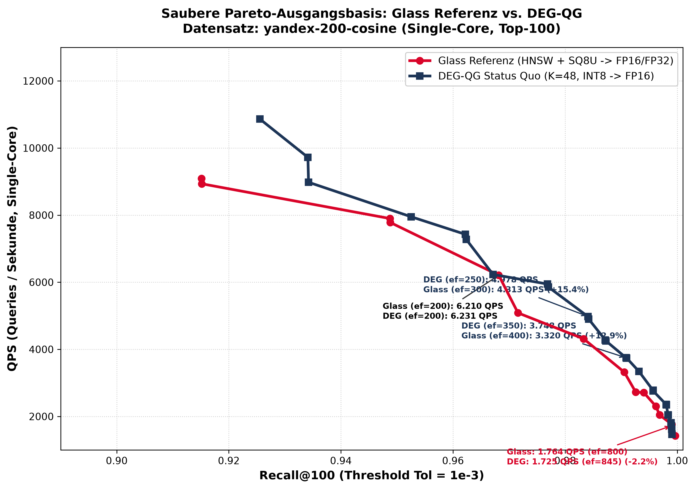

# Saubere Pareto-Ausgangsbasis: Glass Referenz vs. DEG-QG

Dieses Dokument und der zugehörige Plot definieren die **unverfälschte Ausgangsbasis** für die anstehende systematische Evaluation und Bereinigung aller Teiländerungen.

## 1. Direkter Pareto-Vergleich an deckungsgleichen Recall-Punkten

Im Gegensatz zu groben Schwellenwert-Sprüngen vergleicht diese Tabelle direkt die nah beieinander liegenden Messpunkte beider Pareto-Fronten:

| Recall-Bereich | Glass Referenz (Recall / QPS) | DEG-QG Status Quo (Recall / QPS) | Differenz | DEG-QG Parameter |
| :--- | :--- | :--- | :--- | :--- |
| **~95.0%** | 94.88% @ 7782.5 QPS (`R=48, ef=60 (SQ8U+FP32)`) | **95.25% @ 7950.8 QPS** | **+  2.2%** | `rerank=1.00x, ef=150` |
| **~96.8%** | 96.82% @ 6210.1 QPS (`R=48, ef=200 (SQ8U+FP16)`) | **96.71% @ 6231.1 QPS** | **+  0.3%** | `rerank=1.00x, ef=200` |
| **~98.4%** | 98.33% @ 4313.2 QPS (`R=48, ef=300 (SQ8U+FP32)`) | **98.41% @ 4978.0 QPS** | **+ 15.4%** | `rerank=1.15x, ef=250` |
| **~99.1%** | 99.06% @ 3319.7 QPS (`R=48, ef=400 (SQ8U+FP16)`) | **99.09% @ 3747.6 QPS** | **+ 12.9%** | `rerank=1.15x, ef=350` |
| **~99.6%** | 99.62% @ 2300.3 QPS (`R=48, ef=600 (SQ8U+FP16)`) | **99.57% @ 2777.9 QPS** | **+ 20.8%** | `rerank=1.15x, ef=500` |
| **99.90%** | 99.90% @ 1763.8 QPS (`R=48, ef=800 (SQ8U+FP16)`) | **99.90% @ 1716.2 QPS** | ** -2.7%** | `rerank=1.35x, ef=845` |

## 2. Alle Pareto-Punkte von Glass

| Recall@100 | QPS | Konfiguration |
| :--- | :--- | :--- |
|  91.51 % |  9092.1 | `R=32, ef=50 (SQ8U+FP16)` |
|  91.52 % |  8934.0 | `R=32, ef=150 (SQ8U+FP32)` |
|  94.88 % |  7897.4 | `R=48, ef=20 (SQ8U+FP16)` |
|  94.88 % |  7782.5 | `R=48, ef=60 (SQ8U+FP32)` |
|  96.82 % |  6210.1 | `R=48, ef=200 (SQ8U+FP16)` |
|  97.16 % |  5085.7 | `R=32, ef=300 (SQ8U+FP16)` |
|  98.33 % |  4313.2 | `R=48, ef=300 (SQ8U+FP32)` |
|  99.06 % |  3319.7 | `R=48, ef=400 (SQ8U+FP16)` |
|  99.26 % |  2725.4 | `R=32, ef=600 (SQ8U+FP16)` |
|  99.40 % |  2710.9 | `R=48, ef=500 (SQ8U+FP16)` |
|  99.62 % |  2300.3 | `R=48, ef=600 (SQ8U+FP16)` |
|  99.69 % |  2046.1 | `R=32, ef=800 (SQ8U+FP16)` |
|  99.90 % |  1763.8 | `R=48, ef=800 (SQ8U+FP16)` |
|  99.96 % |  1421.0 | `R=48, ef=1000 (SQ8U+FP16)` |

## 3. Alle Pareto-Punkte von DEG-QG (Entzerrtes, wohlverteiltes Gitter)

| Recall@100 | QPS | Konfiguration |
| :--- | :--- | :--- |
|  92.55 % | 10861.6 | `rerank=1.00x, ef=100` |
|  93.41 % |  9721.3 | `rerank=1.15x, ef=100` |
|  93.42 % |  8979.0 | `rerank=1.35x, ef=100` |
|  95.25 % |  7950.8 | `rerank=1.00x, ef=150` |
|  96.22 % |  7427.6 | `rerank=1.15x, ef=150` |
|  96.23 % |  7278.0 | `rerank=1.35x, ef=150` |
|  96.71 % |  6231.1 | `rerank=1.00x, ef=200` |
|  97.68 % |  5946.2 | `rerank=1.15x, ef=200` |
|  97.70 % |  5853.2 | `rerank=1.35x, ef=200` |
|  98.41 % |  4978.0 | `rerank=1.15x, ef=250` |
|  98.42 % |  4902.2 | `rerank=1.35x, ef=250` |
|  98.72 % |  4279.4 | `rerank=1.15x, ef=300` |
|  98.73 % |  4251.4 | `rerank=1.35x, ef=300` |
|  99.09 % |  3747.6 | `rerank=1.15x, ef=350` |
|  99.10 % |  3739.5 | `rerank=1.35x, ef=350` |
|  99.32 % |  3342.6 | `rerank=1.35x, ef=400` |
|  99.57 % |  2777.9 | `rerank=1.15x, ef=500` |
|  99.57 % |  2757.8 | `rerank=1.35x, ef=500` |
|  99.80 % |  2355.9 | `rerank=1.15x, ef=600` |
|  99.81 % |  2344.1 | `rerank=1.35x, ef=600` |
|  99.84 % |  2046.9 | `rerank=1.15x, ef=700` |
|  99.84 % |  2039.1 | `rerank=1.35x, ef=700` |
|  99.89 % |  1809.2 | `rerank=1.15x, ef=800` |
|  99.89 % |  1802.7 | `rerank=1.35x, ef=800` |
|  99.90 % |  1724.8 | `rerank=1.15x, ef=845` |
|  99.90 % |  1716.2 | `rerank=1.35x, ef=845` |
|  99.90 % |  1624.2 | `rerank=1.15x, ef=900` |
|  99.90 % |  1615.7 | `rerank=1.35x, ef=900` |
|  99.91 % |  1474.0 | `rerank=1.15x, ef=1000` |
|  99.91 % |  1468.0 | `rerank=1.35x, ef=1000` |
